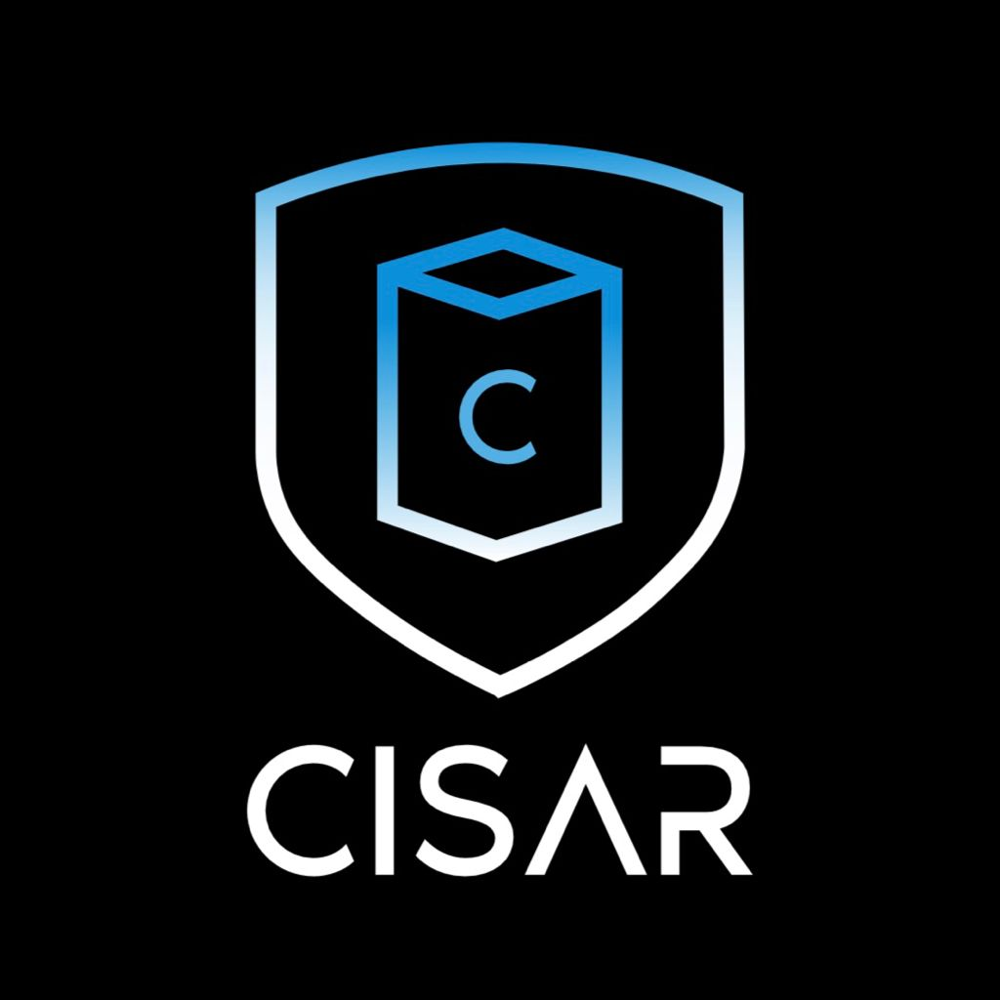

# __Proyecto CISAR 2021 ™__

    Debido a la situación que estamos viviendo actualmente a nivel mundial, se debe tener una gran responsabilidad en relación a los cuidados que tomamos y más aún en lugares donde concurre un gran volumen de personas. Ante esta problemática nos topamos con un modelo de cuidado ineficiente, por ello nuestra propuesta consta de un aparato que nos ayude a lograr esos cuidados de la manera más eficiente posible, reduciendo considerablemente las posibilidades de contagio, logrando un eficiente control de multitudes. Este proyecto está pensado puntualmente para colegios y empresas donde tienen gran volumen de alumnos, hipermercados y fábricas.
# Objetivo:
Nuestro proyecto “Cisar” consiste en un sistema de desinfección y monitoreo eficaz . Está pensado principalmente para que los lugares de gran cantidad de personas, que puedan tener un sistema de desinfección eficaz, controlada y organizada, previniendo el contagio de Covid-19, de todo el volumen de personas de manera automatizada, a través del uso adecuado del barbijo, control de temperatura corporal, la oxigenación en sangre e incitación a esterilizar las manos, el cuerpo en su totalidad y los objetos personales.
Para esto se construirá una cabina sanitizante y un control esterilizador de objetos personales.

# Temática:
Debido a la situación que estamos viviendo actualmente a nivel mundial, se debe tener una gran responsabilidad en relación a los cuidados que tomamos y más aún en lugares donde concurre un gran volumen de personas. Ante esta problemática nos topamos con un modelo de cuidado ineficiente, por ello nuestra propuesta consta de un aparato que nos ayude a lograr esos cuidados de la manera más eficiente posible, reduciendo considerablemente las posibilidades de contagio, logrando un eficiente control de multitudes. Este proyecto está pensado puntualmente para colegios y empresas donde tienen gran volumen de alumnos, hipermercados y fábricas.

# Descripción general:
Nuestra propuesta ante el Coronavirus y su repercusión a nivel mundial, es una cabina con la capacidad de tomar la temperatura de la persona que ingresa, sensar la oxigenación en sangre, desinfectar con un rociado alcohol en las manos, y de detectar la correcta posición del barbijo mediante una cámara, con Inteligencia Artificial .
Para su funcionamiento en régimen normal, el sistema estará enchufado a un cable de red común, de 220v.

Debe tener una cámara que mediante una Raspberry, y un programa ya entrenado de Inteligencia Artificial; identificará la correcta posición del barbijo, en este caso, le mostrará a la persona en una pantalla si está todo dentro de los parámetros correspondientes (Temperatura corporal, Oxigenación en sangre y el tapa boca), dándole acceso a la institución. De lo contrario, le indicará cómo debe ir colocado el tapabocas o cómo proceder ante la detección de una temperatura considerada como fiebre y dará aviso a las autoridades de la institución para que tengan la precaución correspondiente.

Se llevará un registro mediante el cual quedarán asentadas la cantidad de personas que ingresen a la institución, con su horario de ingreso respectivo, su temperatura, y si tenía bien colocado el tapabocas en el primer escaneo que realiza el sistema.

# Segmento de Usuario:
## Ventajas:
1. Desinfecta a los usuarios en cuestion de segundos.
2. No utiliza quimicos nocivos para la salud.
3. Promueve la higiene personal e incitacion a lavarse las manos.
4. Fomenta el cuidado del medio ambiente con el uso de materiales reciclados.
5. Garantiza espacios completamente libres de virus.

# Logros:
-  🥇 Project Idea ONIET 2021
-  🥇 Sello de Identidad ONIET 2021
 
# Integrantes:
  ## *Gonzalez Nuñéz Pedro*
  
  ### Contacto: 
  - Instagram: @pedro_gonzalez_
---
  ## *Osores Martin Nicolás*
  
  ### Contacto: 
  - Instagram: @martin_osores_
---
  ## *Palacios Laureano*
  
  ### Contacto: 
  - Instagram: @laureanopalacios
---
  ## *Ruocco Julian Alberto*
  
   - Instagram: @julian_ruocco
---

## Nuestras Redes:
  - [Instagram (@cisar_cabinas_)](https://instagram.com/cisar_cabinas?utm_medium=copy_link)

